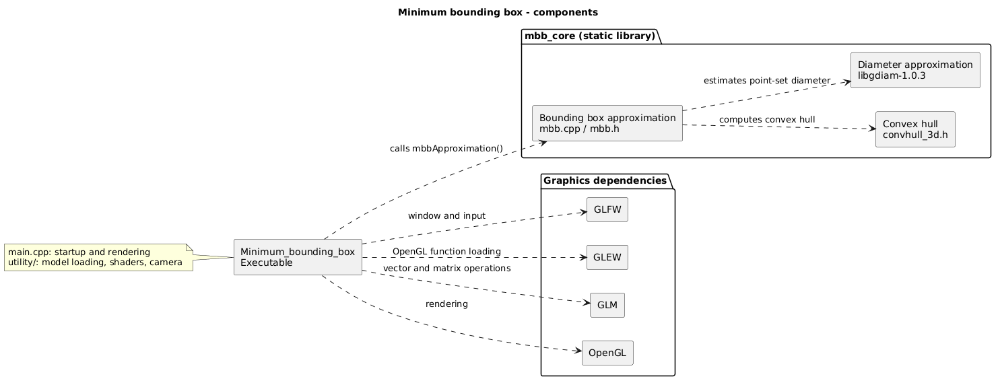

# Minimum bounding box approximation

<p align="center">
  
  
</p>

## Running the program on Linux

### Requirements

On Ubuntu/Debian, install:

- GLEW (The OpenGL Extension Wrangler Library): `sudo apt-get install libglew-dev`
- GLFW (Graphics Library Framework): `sudo apt-get install libglfw3`

If a package cannot be located, run `sudo apt-get update` to update your package lists.
A graphical environment with OpenGL 3.3 support is required.

### Running

Run the program with the path to an OBJ model as its argument, e.g.:

```sh
./Minimum_bounding_box tetrahedron.obj
```

Run from the directory containing the `shaders` directory and the model files
(the repository root when building from source). These paths are relative to
the current working directory, not the executable's location.

## Building on Linux

### Without CMake

In addition to the packages above, install `g++`, `libgl1-mesa-dev`,
`libglfw3-dev` and `libglm-dev`.

Navigate to the source root folder and run:

```sh
g++ *.cpp utility/*.cpp libgdiam-1.0.3/gdiam.cpp -I ./utility/ \
    -DGLM_ENABLE_EXPERIMENTAL -std=c++17 -O1 \
    -lGL -lGLEW -lglfw -o Minimum_bounding_box
```

### Using CMake (Linux and macOS)

On Linux, install `cmake` (3.16 or later) and `make`, along with the development
packages listed above. On macOS, install Xcode Command Line Tools and use
`brew install cmake glew glfw glm`.

Navigate to the source root folder and run:

```sh
cmake -S . -B build -DCMAKE_BUILD_TYPE=Release
cmake --build build
```

Use `-DCMAKE_BUILD_TYPE=Debug` in a separate build directory for debugging.
After a successful build, run the program as described above.

## Architecture

The diagram shows the application, the `mbb_core` library and their dependencies.
PlantUML source: [docs/architecture.puml](docs/architecture.puml).


